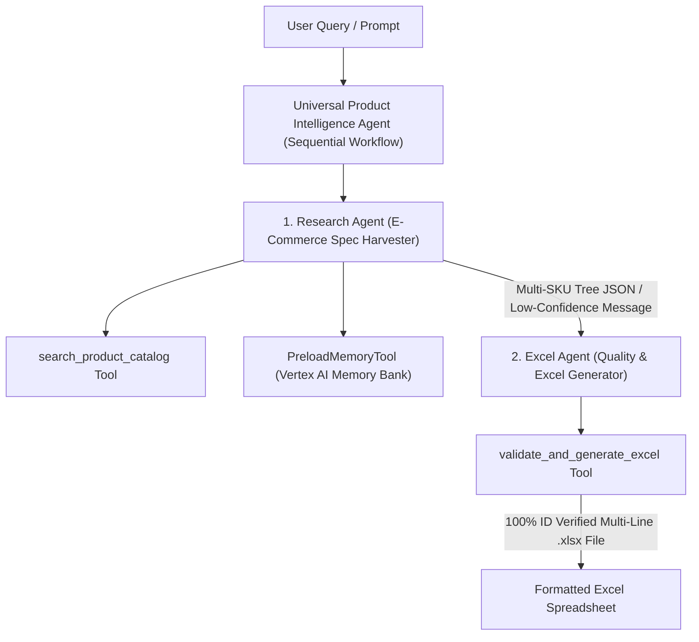

# Universal Product Intelligence & Multi-SKU Excel Agent System

## Executive Overview
An autonomous multi-agent platform powered by Google ADK (Agent Development Kit), Gemini 2.5, Vertex AI Memory Bank, and OpenPyXL. The system ingests sparse product queries (descriptions, VPNs, MPNs, or barcode numbers), performs domain-aware catalog research, constructs multi-SKU tree JSON specifications, enforces confidence threshold guardrail validation, and outputs structured multi-line Excel spreadsheets.

---

## System Architecture

---

## Core Features & Safety Guardrails

1. **Domain-Aware Multi-SKU Resolution**:
   - **Footwear & Apparel**: Dynamically resolves footwear taxonomies, leather attributes, UNSPSC `53111501`, and HS Code `6403.51.1110`.
   - **Fragrances & Beauty**: Dynamically resolves beauty taxonomies, volume sizes, UNSPSC `53131621`, and HS Code `3303.00.1000`.
   - **Electronics & Consumer Goods**: Dynamically resolves tech specifications, capacity, UNSPSC `43211509`, and HS Code `8471.30.0100`.

2. **Low Confidence & Query Mismatch Safety Guardrail**:
   - Requires confidence score $\ge 0.70$.
   - If confidence is too low or query keywords do not match product family results, the agent stops and returns a clear warning:
     > *"Unable to find reliable information for query. Search confidence score is too low (< 0.70). Additional details (Brand, UPC, GTIN, or exact Part Number) are required."*

3. **Multi-SKU Tree JSON Harvester**:
   - Collects top-level product family information along with an array of individual SKU variants, pricing, universal identifiers (GTIN, UPC, EAN, MPN, VPN, ASIN, UNSPSC, HS Code), and technical attributes.

4. **Multi-Line Excel Spreadsheet Generation**:
   - Formats every SKU into a styled row with header blocks, metadata retention, filename sanitization, and ID validation status badges.

5. **100% Test Coverage & Automated Quality Assurance**:
   - Every module verified with `pytest --cov=app` reaching **100% total statement coverage**.

---

## Repository & Deployment Info
- **GitHub Repository**: [https://github.com/therealghburner/buildwithgemini-universal-product-intelligence-agent](https://github.com/therealghburner/buildwithgemini-universal-product-intelligence-agent)
- **GCP Project**: `qwiklabs-gcp-03-ef713aa8c2c9`
- **Vertex AI Agent Runtime ID**: `projects/562681496404/locations/us-central1/reasoningEngines/4445256791621632000`
- **Local Dev UI**: `http://localhost:8000/dev-ui/?app=app`
